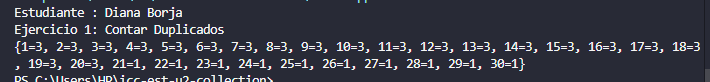
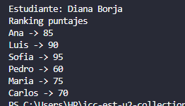

# Práctica: Estructuras No Lineales - 

## Autor
- Nombre: Diana Borja
- Carrera/Curso: Estructura de Datos

##  Nombre de la práctica - Fecha
- Práctica: Ejercicios con Mapas
- Fecha: 2026 - 01 - 19

## Descripción
Para

## Evidencias
### Captura 1 - Ejercicio 1 -  **Contar Duplicados¨**
Resultado de la Ejecucion : Dada una secuencia de N enteros, determine cuántas veces aparece cada número.

- Archivo: 

### Captura 2 - Ejercicio 2 -  **Primer elemento no repetido**
Dada una secuencia de enteros, determine el primer número que no se repite, respetando el orden de aparición.

- Archivo: 

### Captura 3 - Ejercicio 3 - **Ranking de puntajes**
Se recibe una lista de jugadores con su puntaje.
Si un jugador aparece más de una vez, se conserva el mayor puntaje.
Imprimir el ranking ordenado por puntaje descendente.

- Archivo: 

